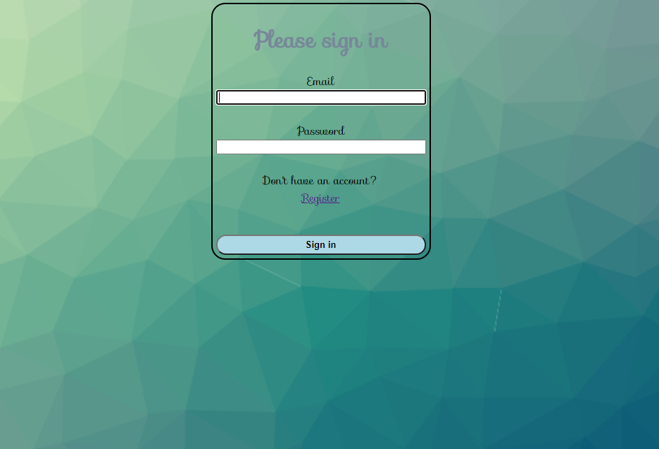

# BIBLIOTEKA
PHP, SYMFONY, MySQl/Doctrine, Routes, OOP, CKEditor, BCrypt, securityToken

# PHP / SYMFONY
### Level-beginner

This repository is for educational porpuses only. 

### Info

Only registrated and sign-in users can access the program.

** This site is not published **

### Authors
[Mazvydas](https://github.com/Slashass)